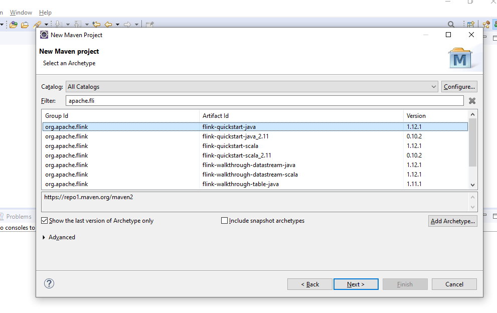
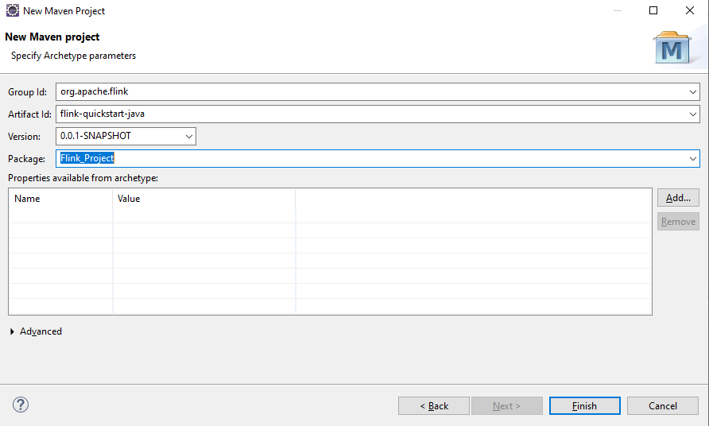
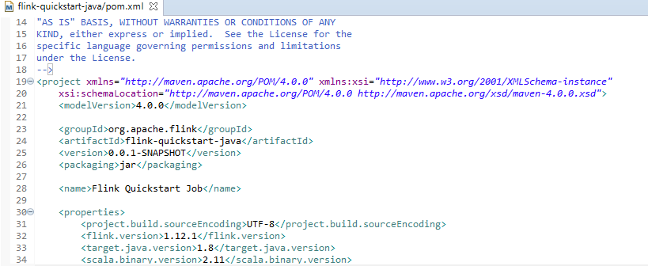
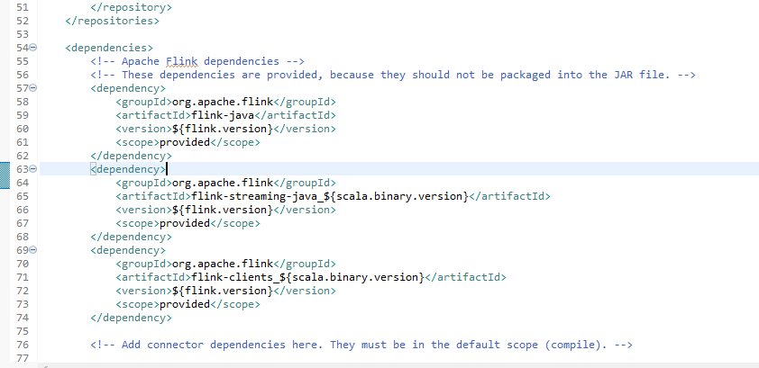

# Bigdata-Flink-Java

## Team Members
- Harish Thadka
- Vikas Baswapuram
- Rohith Chittimalla
- Deekshith Maram
- Sumanth Reddy Naidu
- Puneeth Annam

## Contributors

<table>
  <tr>
    <td align="center"><a href="https://github.com/harishThadka"><br /><sub><b>Harish Thadka</b></sub></a><br /><a href="https://github.com/harishThadka" title="Code">💻</a></td>
    <td align="center"><a href="https://github.com/Vikas2004"><br /><sub><b>Vikas Baswapuram</b></sub></a><br /><a href="https://github.com/Vikas2004" title="Code">💻</a></td>
    <td align="center"><a href="https://github.com/rohith0696"><br /><sub><b>Rohith Chittimalla</b></sub></a><br /><a href="https://github.com/rohith0696" title="Code">💻</a></td>
    <td align="center"><a href="https://github.com/Dixith1196"><br /><sub><b>Deekshith Maram</b></sub></a><br /><a href="https://github.com/Dixith1196" title="Code">💻</a></td>
    <td align="center"><a href="https://github.com/sumanthreddy1233"><br /><sub><b>Sumanth Reddy Naidu</b></sub></a><br /><a href="https://github.com/sumanthreddy1233" title="Code">💻</a></td>
    <td align="center"><a href="https://github.com/Puneeth159"><br /><sub><b>Puneeth Annam</b></sub></a><br /><a href="https://github.com/Puneeth159" title="Code">💻</a></td>
    </tr>
`   </table>

## Apache Flink:

### Introduction:
- Apache Flink is an open-source, unified stream-processing and batch-processing framework developed by the Apache Software Foundation
- The core of Apache Flink is a distributed streaming data-flow engine written in Java and Scala
- Flink provides a high-throughput, low-latency streaming engine
- Flink offers substantially higher processing speeds to spark and hadoop.


## Vikas:

### Topic: Introduction to Flink and Getting started with Java and demonstrating the WordCount:

### Introduction to Flink:

-  Apache Flink can be [downloaded](https://www.apache.org/dyn/closer.lua/flink/flink-1.12.1/flink-1.12.1-bin-scala_2.11.tgz) here.

- You will have to download the suggested mirror site for the download. Image is provided below for the reference.


- After the file is downloaded untar the file. This can be done using either ```powershell``` or extracting the files using ```7-zip```.

- The command for powershell is as follows: ```tar -xvf <filename.tgz>```.

- My powershell command would be ```tar -xvf flink-1.12.1-bin-scala_2.11.tgz```.

- If you are using the 7-zip then here is the reference image to extract the file to the location.(Preferably C drive).


- Set up system variable ```FLINK_HOME``` and configure it to the ```C:\flink-1.11.2``` folder location and configure the path accordingly.


### Using Flink on Maven:

- To demonstrate the maven project I am using the ```eclipse IDE```.

- Steps to start the maven project. ``` Open eclipse IDE -> File -> New -> Other -> Maven -> Maven Project```.

- After using the above steps click on next and you will get a new window where you have to select the ```Group Id```, ```Artifact Id```, ```Version```. Please select them as shown in the below image. This can be done just by typing in the Filter field.


-  Then you will be directed to another window which looks like the image below. You can choose the Package name of your choice. Also make sure to check if the other fields are correct.


- Once the project is created go to the target folder of the maven project check the pom.xml file where you ca find the details as shown below.


- Check the dependencies under the tag dependencies where all the flink dependencies are auto generated with the mave project. Here is an image of the dependencies of my project.


```Powershell
If you try to add a new class it might show you some error stating "This is not a java source folder". 
To overcome this issue right click on the project and select Properties, click on the Project Facets and then click on "Convert to faceted form" and then select java, Apply and close you will now be able to add a new java class file.
```
- The above step is to be followed if there is an error else ignore.

- Then run the project selecting the maven test option to build the maven dependencies.

- Start coding and write the apis in the java file to do the desired operation.

### Resources:

- https://mycupoftea00.medium.com/how-to-run-apache-flink-locally-b20735523ee1
- https://ci.apache.org/projects/flink/flink-docs-release-1.2/quickstart/setup_quickstart.html
- https://www.toolsqa.com/java/maven/create-new-maven-project-eclipse/

