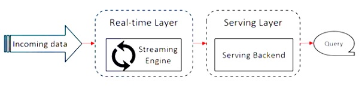
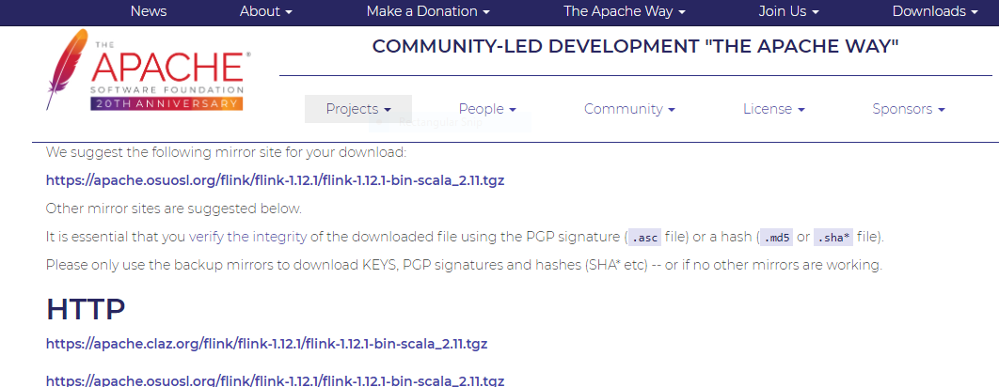
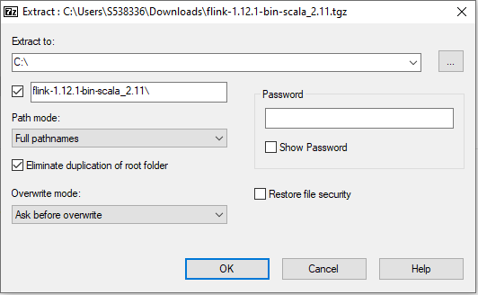
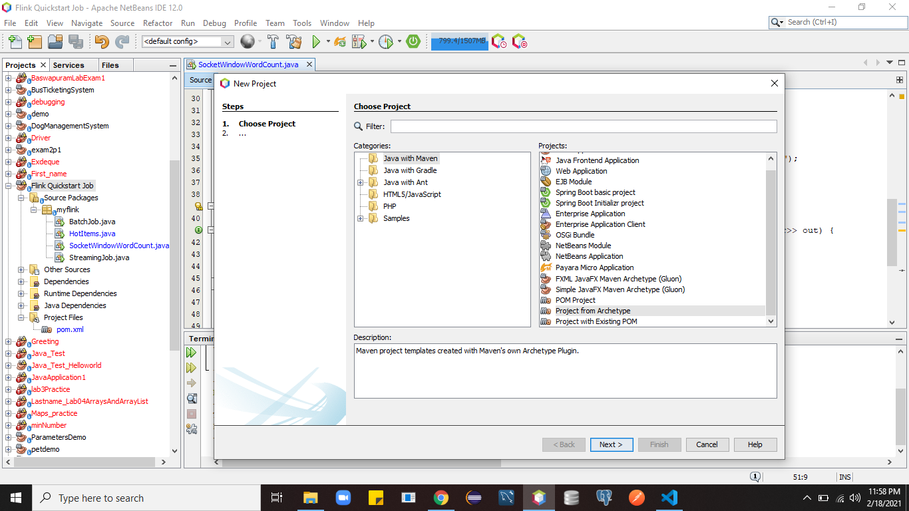
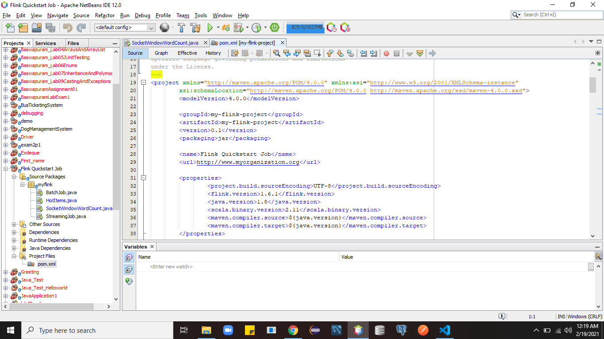
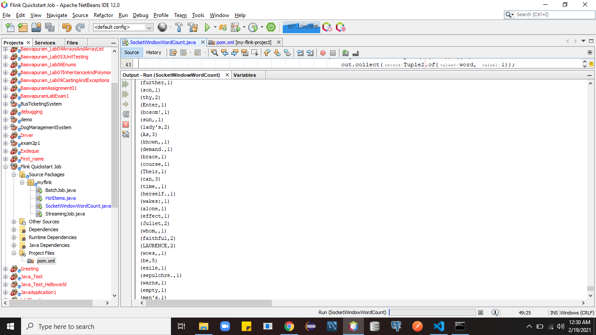
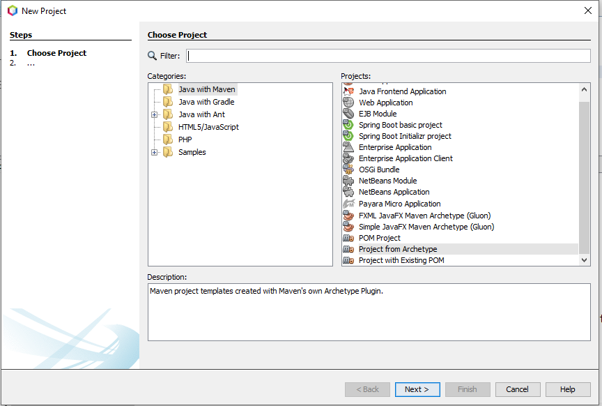
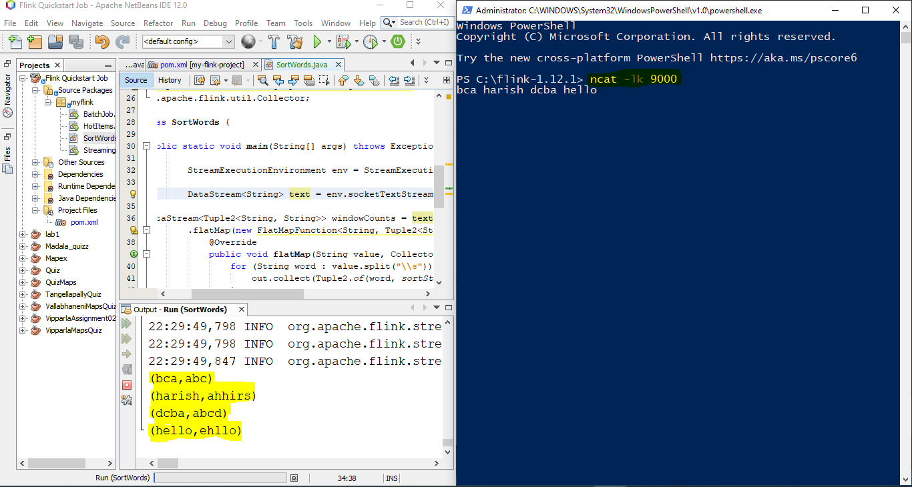
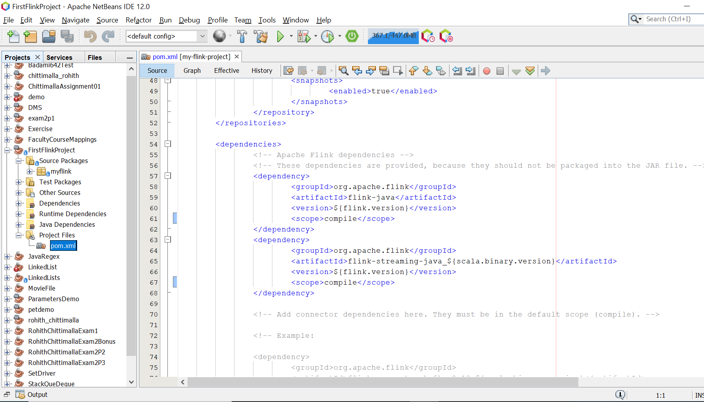
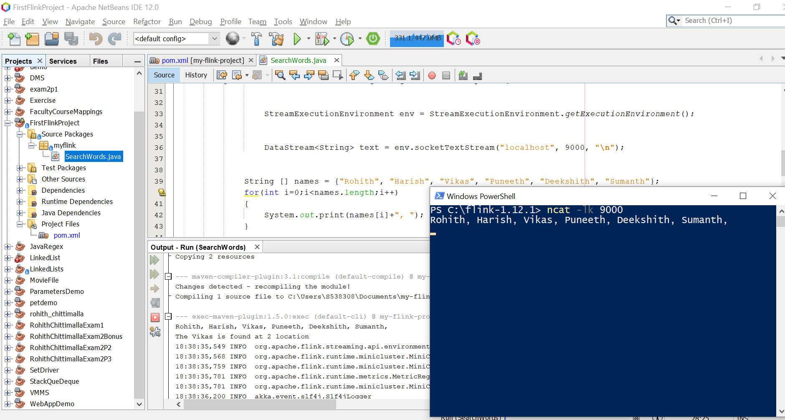

# Bigdata-Flink-Java
## Team Members
<table>
  <tr>
    <td align="center"><a href="https://github.com/harishThadka"><br /><sub><b>Harish Thadka</b></sub></a><br /><a href="https://github.com/harishThadka" title="Code">💻</a></td>
    <td align="center"><a href="https://github.com/Vikas2004"><br /><sub><b>Vikas Baswapuram</b></sub></a><br /><a href="https://github.com/Vikas2004" title="Code">💻</a></td>
    <td align="center"><a href="https://github.com/rohith0696"><br /><sub><b>Rohith Chittimalla</b></sub></a><br /><a href="https://github.com/rohith0696" title="Code">💻</a></td>
    <td align="center"><a href="https://github.com/Dixith1196"><br /><sub><b>Deekshith Maram</b></sub></a><br /><a href="https://github.com/Dixith1196" title="Code">💻</a></td>
    <td align="center"><a href="https://github.com/sumanthreddy1233"><br /><sub><b>Sumanth Reddy Naidu</b></sub></a><br /><a href="https://github.com/sumanthreddy1233" title="Code">💻</a></td>
    <td align="center"><a href="https://github.com/Puneeth159"><br /><sub><b>Puneeth Annam</b></sub></a><br /><a href="https://github.com/Puneeth159" title="Code">💻</a></td>
    </tr>
`   </table>

## What is Apache Flink?🤔
### Introduction:
- Apache Flink is an open-source, unified stream-processing and batch-processing framework developed by the Apache Software Foundation
- The core of Apache Flink is a distributed streaming data-flow engine written in Java, Scala and python
- Flink provides a high-throughput, low-latency streaming engine
- Flink offers substantially higher processing speeds to spark and hadoop.

### Flink Architecture

### Prerequisites
- [Apache Flink](https://www.apache.org/dyn/closer.lua/flink/flink-1.12.1/flink-1.12.1-bin-scala_2.11.tgz)
- [Java 8](https://www.java.com/en/download/) or later versions
- [IntelliJ IDE](https://www.jetbrains.com/idea/download/#section=windows) or [Eclipse IDE](https://www.eclipse.org/ide/)
- [NetCat](https://nmap.org/download.html)
### Features of Apache Flink
- It has a streaming processor, which can run both batch and stream programs.
- APIs available in Java, Scala and Python.
- Can easily integrate with Apache Hadoop, Apache MapReduce, Apache Spark, HBase and other big data tools.
- Provides Graph Processing, Machine Learning, Complex Event Processing libraries.
### More about Apache flink
- https://en.wikipedia.org/wiki/Apache_Flink
- https://docs.cloudera.com/csa/1.2.0/flink-overview/topics/csa-flink-overview.html
- https://blogs.oracle.com/javamagazine/streaming-analytics-with-java-and-apache-flink
- https://www.tutorialspoint.com/apache_flink/apache_flink_quick_guide.htm
## What is Java?🤔
### Introduction:
- Java is a class-based, object-oriented programming language that is designed to have as few implementation dependencies as possible.
- Java applications are typically compiled to bytecode that can run on any Java virtual machine (JVM) regardless of the underlying computer architecture
-Java was originally developed by James Gosling at Sun Microsystems (which has since been acquired by Oracle) and released in 1995 as a core component of Sun Microsystems' Java platform. 
- According to Oracle, 3 billion devices run on Java
### More about Apache Flink with Java:
- https://ci.apache.org/projects/flink/flink-docs-release-1.2/quickstart/java_api_quickstart.html
- https://www.baeldung.com/apache-flink
- https://www.tutorialdocs.com/article/first-flink-app.html

## Group data source:
- [Football Data: Expected Goals and Other Metrics](https://www.kaggle.com/slehkyi/extended-football-stats-for-european-leagues-xg)
## Team members demonstration Topics:

- Vikas Baswarpuram: **WordCount Apache Flink Application**
- Harish Thaka: **Sorting words on Apache Flink**
- Rohith Chittimala: **Searching word on Apache Flink Application**
- Deekshith Maram: **Apache Flink Application on  Aggregation**
- Sumanth reddy naidu: **Total number of words on Apache Flink**
- Puneeth Annam: **Maximum number on Apache Flink**
## Vikas Baswapuram:

### Demonstration Topic : Introduction to Flink and Getting started with Java and demonstrating the WordCount:

### Introduction to Flink:

-  Apache Flink can be [downloaded](https://www.apache.org/dyn/closer.lua/flink/flink-1.12.1/flink-1.12.1-bin-scala_2.11.tgz) here.

- You will have to download the suggested mirror site for the download. Image is provided below for the reference.



- After the file is downloaded untar the file. This can be done using either ```powershell``` or extracting the files using ```7-zip```.

- The command for powershell is as follows: ```tar -xvf <filename.tgz>```.

- My powershell command would be ```tar -xvf flink-1.12.1-bin-scala_2.11.tgz```.

- If you are using the 7-zip then here is the reference image to extract the file to the location.(Preferably C drive).


- Set up system variable ```FLINK_HOME``` and configure it to the ```C:\flink-1.11.2``` folder location and configure the path accordingly.


### Using Flink on Maven:

- To demonstrate the maven project I am using the ```Netbeans IDE```.

- Steps to start the maven project.

- Step 1:

 ``` Open NetBeans IDE -> File -> New Project. Select Java with Maven then Project from Archetype```



- Step 2:

``` Select flink-quickstart-data -> Entered desired Project Name and Package Name and create them.```

After the above steps you will see the pom.xml which would look like this.


- You will also have to add dependencies of the maven with flink. Here I am also putting up the dependencies I have used.
```Powershell
<dependencies>
		<!-- Apache Flink dependencies -->
		<!-- These dependencies are provided, because they should not be packaged into the JAR file. -->
		<dependency>
			<groupId>org.apache.flink</groupId>
			<artifactId>flink-java</artifactId>
			<version>${flink.version}</version>
			<scope>compile</scope>
		</dependency>
		<dependency>
			<groupId>org.apache.flink</groupId>
			<artifactId>flink-streaming-java_${scala.binary.version}</artifactId>
			<version>${flink.version}</version>
			<scope>compile</scope>
		</dependency>
```
-  The dependencies can be explored [here.](https://mvnrepository.com/artifact/org.apache.flink)

- After these steps now add in the java class file and insert your code.

- Before running the code first we need to clean build maven project and then start the ncat- server with the following command in any terminal.
``` ncat -l 9000```

- Then run the java file and once we file starts running then we can enter the data into the terminal and we can see the output of the java function in the output console of the IDE.



### Prerequisites:

1. openjdk
1. maven
1. NetBeans IDE

### Edit the System Environment Variables:

- Add these new paths

1. JAVA_HOME = C:\Program Files\OpenJDK\jdk-version folder
1. FLINK_HOME =  C:\flink-version folder
1. M2_HOME = C:\ProgramData\chocolatey\lib\maven\apache-maven-version

- Path - must include 

1. %JAVA_HOME%\bin 
1. %M2_HOME%\bin
1. %FLINK_HOME%\bin

```Make sure you have only one JDK location in your path.```

## Video Link:

https://drive.google.com/file/d/1wDbzfOq9G3YbbAugm-R3p6cOEqaYVoTn/view?usp=sharing


### Resources:
- https://mycupoftea00.medium.com/how-to-run-apache-flink-locally-b20735523ee1
- https://ci.apache.org/projects/flink/flink-docs-release-1.2/quickstart/setup_quickstart.html
- https://www.toolsqa.com/java/maven/create-new-maven-project-eclipse/
- https://github.com/wuchong/my-flink-project
- https://mvnrepository.com/artifact/org.apache.flink


## Harish Thadka:
### Demonstration Topic : Sorting Words on Apache Flink
- Video link: 
### Installation:

- Prerequisites:
  1. maven
  1. openjdk
  1. NetBeans IDE

- Downlaod Apache Flink from this link: https://www.apache.org/dyn/closer.lua/flink/flink-1.12.1/flink-1.12.1-bin-scala_2.11.tgz
- Put the .tgz file in C:\ folder
- Un-tar it (using Bash) and change into the directory.  The $ indicates a Bash prompt.
```
tar -xzf <filename.tgz>
cd <folder>
```
- Next download Net cat from this link: https://nmap.org/download.html
### Setup environment variables:
- Windows + Edit the System Environment Variables / Environment Variables / System variables (bottom half). Note:  Use the version you installed in the following. 
    1. JAVA_HOME = C:\Program Files\OpenJDK\jdk-version folder
    1. FLINK_HOME =  C:\flink-version folder
    1. M2_HOME = C:\ProgramData\chocolatey\lib\maven\apache-maven-version
- Path - must include (make sure you have only one JDK location in your path!)
1. %JAVA_HOME%\bin OR C:\Program Files\OpenJDK\jdk-version\bin (or similar, NOT both!)
1. %M2_HOME%\bin
1. %FLINK_HOME%\bin
### Run Apache Flink in Apache NetBeans IDE

- Open NetBeans IDE -> File -> New Project. Select Java with Maven then Project from Archetype



- Click Next, Search Flink and select 'flink-quickstart-java' and give your own project Name . click on finish

- Make sure pom.xml has below flink dependencies:
```
<dependency>
  <groupId>org.apache.flink</groupId>
  <artifactId>flink-java</artifactId>
  <version>${flink.version}</version>
  <scope>compile</scope>
</dependency>
<dependency>
  <groupId>org.apache.flink</groupId>
  <artifactId>flink-streaming-java_${scala.binary.version}</artifactId>
  <version>${flink.version}</version>
  <scope>compile</scope>
</dependency>
```
- Create new Java file with filename= SortWords
- Copy code from this [link](https://github.com/harishThadka/Flink-Java/blob/main/harish/SortWords.java) and paste it:
- Run the ncat server at the terminal using the command 
```
ncat -l 9000
```
- Run the Java file
- Enter any data in terminal. Sorting output will be shown in Netbeans Ouput




### Issues:
- https://stackoverflow.com/questions/54106187/apache-flink-java-lang-noclassdeffounderror/54106784
### References:
- https://ci.apache.org/projects/flink/flink-docs-release-1.2/dev/datastream_api.html
- https://riptutorial.com/apache-flink
- https://github.com/wuchong/my-flink-project

## Rohith Chittimala: 
### Demonstration Topic : Searching word on Apache Flink Application
- Video Link:

### Prerequisites:

- Openjdk
- Maven
- NetBeans IDE

### Running Apache Flink in NetBeans IDE

- Open NetBeans IDE then File then New Project.
- Select Java with Maven then project from Archetype.


- Click Next then search Flink and select 'flink-quickstart-java' and write project name and click on Finish.
- Go to the ``` pom.xml ``` file of the project to verify the availabilities of flink dependencies.



- Create a new java file with "SearchNumber" as the filename.
- Here is the code for the [SearchNumber](https://github.com/harishThadka/Flink-Java/blob/main/rohith/SearchWords.java) program.
- First clean and build maven project and start the ncat server with the following command in the terminal.
 ``` ncat -l 9000 ```
- After running the above command we can see the results in the netbeans output console.
- Here is the Image:



### References:
- https://github.com/wuchong/my-flink-project
- https://mvnrepository.com/artifact/org.apache.flink
- https://riptutorial.com/apache-flink


## Deekshith Maram:
### Demonstration Topic : Apache Flink Application on  Aggregation 

## Sumanth Reddy:
### Demonstration Topic : Total number of words on Apache Flink
### CITATION: https://github.com/apache/flink/tree/master/flink-examples/flink-examples-batch/src/main/java/org/apache/flink/examples/java/wordcount

## Puneeth Annam:
### Demonstration Topic : Maximum number on Apache Flink
